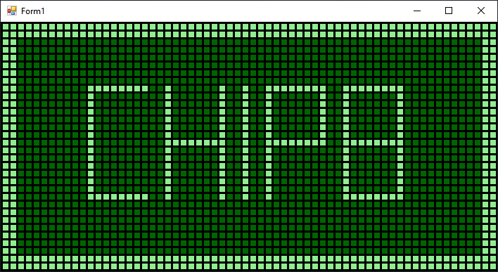

# chip8-emu
 A basic emulator for Chip-8.

This is not 100% percent functional, but it's relatively easy to modify to add all the enhancements needed.

## Usage

Drag and drop any Chip-8 ROM files on the main window, and use the next keys to emulate the Chip-8 keyboard:

`` 1 2 3 4				 1 2 3 C ``
`` Q W E R	 	-->		 4 5 6 D ``
`` A S D F	 	-->		 7 8 9 E ``
`` Z X C V				 A 0 B F ``

##  Known bugs / "To Do" list

- It has no sound, but the sound timer is totally working
- The screen flickers. Probably there are better ways to print the pixel screen
- Super Chip instructions are not implemented
- Waiting for keyboard event isn't implemented

## License

MIT License

Copyright (c) 2021 Josemi Rodríguez

Permission is hereby granted, free of charge, to any person obtaining a copy
of this software and associated documentation files (the "Software"), to deal
in the Software without restriction, including without limitation the rights
to use, copy, modify, merge, publish, distribute, sublicense, and/or sell
copies of the Software, and to permit persons to whom the Software is
furnished to do so, subject to the following conditions:

The above copyright notice and this permission notice shall be included in all
copies or substantial portions of the Software.

THE SOFTWARE IS PROVIDED "AS IS", WITHOUT WARRANTY OF ANY KIND, EXPRESS OR
IMPLIED, INCLUDING BUT NOT LIMITED TO THE WARRANTIES OF MERCHANTABILITY,
FITNESS FOR A PARTICULAR PURPOSE AND NONINFRINGEMENT. IN NO EVENT SHALL THE
AUTHORS OR COPYRIGHT HOLDERS BE LIABLE FOR ANY CLAIM, DAMAGES OR OTHER
LIABILITY, WHETHER IN AN ACTION OF CONTRACT, TORT OR OTHERWISE, ARISING FROM,
OUT OF OR IN CONNECTION WITH THE SOFTWARE OR THE USE OR OTHER DEALINGS IN THE
SOFTWARE.
